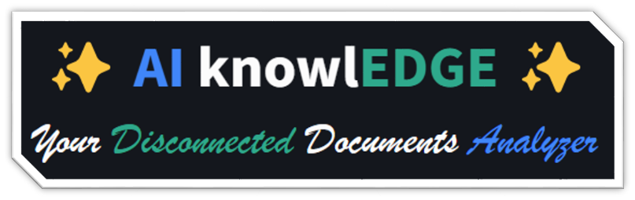

<a name="readme-top"></a>

<!-- PROJECT SHIELDS -->
[![Contributors][contributors-shield]][contributors-url]
[![Forks][forks-shield]][forks-url]
[![Stargazers][stars-shield]][stars-url]
[![Issues][issues-shield]][issues-url]
[![MIT License][license-shield]][license-url]
[![LinkedIn][linkedin-shield]][linkedin-url]

<br />
<div align="center">
  

  <h3 align="center">AIknowlEDGE</h3>
  <p align="center">
    AIknowlEDGE is a desktop application built with Electron.js and Python FastAPI to showcase Disconnected Containers.  
    <br />
    <a href="https://github.com/AzureSamples/AIknowlEDGE"><strong>Explore the docs »</strong></a>
    <br />
    <br />
    <a href="https://github.com/AzureSamples/AIknowlEDGE">View Demo</a>
    ·
    <a href="https://github.com/AzureSamples/AIknowlEDGE/issues">Report Bug</a>
    ·
    <a href="https://github.com/AzureSamples/AIknowlEDGE/issues">Request Feature</a>
  </p>
</div>

<details>
  <summary>Table of Contents</summary>
  <ol>
    <li>
      <a href="#about-the-project">About The Project</a>
      <ul>
        <li><a href="#built-with">Built With</a></li>
      </ul>
    </li>
    <li>
      <a href="#getting-started">Getting Started</a>
      <ul>
        <li><a href="#prerequisites">Prerequisites</a></li>
        <li><a href="#installation">Installation</a></li>
      </ul>
    </li>
    <li><a href="#usage">Usage</a></li>
    <li><a href="#roadmap">Roadmap</a></li>
    <li><a href="#contributing">Contributing</a></li>
    <li><a href="#license">License</a></li>
    <li><a href="#contact">Contact</a></li>
    <li><a href="#acknowledgments">Acknowledgments</a></li>
  </ol>
</details>

<!-- ABOUT THE PROJECT -->
## About The Project

[![Product Name Screen Shot][product-screenshot]](https://example.com)

Containers let you run Azure AI services in your own environment, meeting security and data governance requirements. Disconnected containers let you run many of these services offline.

<p align="right">(<a href="#readme-top">back to top</a>)</p>

### Built With
* [![Python][Python-logo]][Python-url]
* [![Fastapi][Fastapi-logo]][Fastapi-url]
* [![Nodejs][Nodejs-logo]][Nodejs-url]

<p align="right">(<a href="#readme-top">back to top</a>)</p>

<!-- GETTING STARTED -->
## Getting Started

Follow these steps to run the project locally.

### Prerequisites

- Node.js  
- Python 3.12+  
- Docker  
- VS Code  
- Ollama  

### Installation

1. Clone the repository:
    ```git
    git clone https://github.com/Azure-Samples/AIknowlEDGE.git
    cd AIknowlEDGE
    ```

2. Install Docker and pull the container:
    ```sh
    docker pull mcr.microsoft.com/azure-cognitive-services/textanalytics/summarization:cpu
    ```

3. Get your Cognitive Services keys and endpoints:
    ```
    AZURE_DOCUMENT_ANALYSIS_ENDPOINT
    AZURE_DOCUMENT_ANALYSIS_KEY
    LANGUAGE_ENDPOINT
    LANGUAGE_KEY
    ```

4. Create a folder on your C:/ drive named `ExtractiveModel`.

5. Download the SLMs for the Summarization Service. Start Docker and run:
    ```Docker
    docker run -v C:\ExtractiveModel:/models mcr.microsoft.com/azure-cognitive-services/textanalytics/summarization:cpu downloadModels=ExtractiveSummarization billing=LANGUAGE_ENDPOINT apikey=LANGUAGE_KEY
    ```

6. Set up the Python environment and install dependencies:
    ```sh
    cd backend
    python -m venv venv
    venv\Scripts\activate  # On Linux use `source venv/bin/activate`
    pip install -r requirements.txt
    ```

7. Create a docker-compose.yml with the following:
    ```YAML
    version: "3.9"
    services:
      azure-form-recognizer-read:
        container_name: azure-form-recognizer-read
        image: mcr.microsoft.com/azure-cognitive-services/form-recognizer/read-3.1
        environment:
          - EULA=accept
          - billing=<document-intelligence-endpoint>
          - apiKey=<document-intelligence-key>
        ports:
          - "5000:5000"
        networks:
          - ocrvnet

      textanalytics:
        image: mcr.microsoft.com/azure-cognitive-services/textanalytics/summarization:cpu
        environment:
          - eula=accept
          - rai_terms=accept
          - billing=<language-endoint>
          - apikey=<language-key> 
        volumes:
          - "C:\\ExtractiveModel:/models"
        ports:
          - "5001:5000"

    networks:
      ocrvnet:
        driver: bridge
    ```

8. Create the container by running:
    ```sh
    docker-compose up
    ```

9. Make a .env file:
    ```
    AZURE_DOCUMENT_ANALYSIS_ENDPOINT=http://localhost:5000
    AZURE_DOCUMENT_ANALYSIS_KEY=<document-intelligence-key>
    LANGUAGE_ENDPOINT=http://localhost:5001
    LANGUAGE_KEY=<language-key>
    ```

10. Download Ollama and install at least one SLM and one embedding model:
    ```sh
    ollama pull phi3
    ollama pull nomic-embed-text
    ```

11. Start the application from VS Code: F5 or Run > Start Debugging

<p align="right">(<a href="#readme-top">back to top</a>)</p>

<!-- USAGE EXAMPLES -->
## Debugging

1. Start the FastAPI backend:
    ```sh
    cd backend
    uvicorn main:app --port 8000
    ```

2. Start the Streamlit app:
    ```sh
    cd frontend
    streamlit run app.py --server.port=8501
    ```

<p align="right">(<a href="#readme-top">back to top</a>)</p>

<!-- ROADMAP -->
## Roadmap

- [ ] Other Containers Integration
  - [ ] Speech service
  - [ ] Translation service
- [ ] Other Use Cases Integration
- [ ] Packaging
  - [ ] Single-click installation
  - [ ] Cross-platform installation

See the [open issues](https://github.com/Azure-Samples/AIknowlEDGE/issues) for proposed features and known issues.

<p align="right">(<a href="#readme-top">back to top</a>)</p>

<!-- CONTRIBUTING -->
## Contributing

Contributions make open source great. We appreciate all contributions.

1. Fork this repo
2. Create a Feature Branch (`git checkout -b feature/AmazingFeature`)
3. Commit your changes (`git commit -m 'Add some AmazingFeature'`)
4. Push to the branch (`git push origin feature/AmazingFeature`)
5. Open a Pull Request

<p align="right">(<a href="#readme-top">back to top</a>)</p>

<!-- LICENSE -->
## License

Distributed under the MIT License. See `LICENSE.txt` for more info.

<p align="right">(<a href="#readme-top">back to top</a>)</p>

<!-- CONTACT -->
## Contact

Raoui Lassoued [LinkedIn](https://www.linkedin.com/in/raoui-lassoued-07332165/)
Serge Retkowsky [LinkedIn](https://www.linkedin.com/in/serger/)
Farid El Attaoui [LinkedIn](https://www.linkedin.com/in/farid-el-attaoui/)
Alibek Jakupov [@ajakupov1](https://twitter.com/ajakupov1) [LinkedIn](https://www.linkedin.com/in/alibek-jakupov-30305b61/)

Project Link: [DocEdge](https://learn.microsoft.com/en-us/azure/ai-services/containers/disconnected-container-faq)

<p align="right">(<a href="#readme-top">back to top</a>)</p>

<!-- ACKNOWLEDGMENTS -->
## Acknowledgments

* Microsoft France

<p align="right">(<a href="#readme-top">back to top</a>)</p>

<!-- MARKDOWN LINKS & IMAGES -->
[contributors-shield]: https://img.shields.io/github/contributors/ajakupov/NewsExplorer.svg?style=for-the-badge
[contributors-url]: https://github.com/ajakupov/NewsExplorer/graphs/contributors
[forks-shield]: https://img.shields.io/github/forks/ajakupov/NewsExplorer.svg?style=for-the-badge
[forks-url]: https://github.com/ajakupov/NewsExplorer/network/members
[stars-shield]: https://img.shields.io/github/stars/ajakupov/NewsExplorer.svg?style=for-the-badge
[stars-url]: https://github.com/ajakupov/NewsExplorer/stargazers
[issues-shield]: https://img.shields.io/github/issues/ajakupov/NewsExplorer.svg?style=for-the-badge
[issues-url]: https://github.com/ajakupov/NewsExplorer/issues
[license-shield]: https://img.shields.io/github/license/ajakupov/NewsExplorer.svg?style=for-the-badge
[license-url]: https://github.com/ajakupov/NewsExplorer/blob/main/LICENSE
[linkedin-shield]: https://img.shields.io/badge/-LinkedIn-black.svg?style=for-the-badge&logo=linkedin&colorB=555
[linkedin-url]: https://www.linkedin.com/company/microsoft/
[product-screenshot]: https://learn.microsoft.com/en-us/azure/ai-services/containers/media/container-security.svg
[Python-logo]: https://img.shields.io/badge/python-0769AD?style=for-the-badge&logo=python&logoColor=white
[Python-url]: https://www.python.org
[Django-logo]: https://img.shields.io/badge/django-35495E?style=for-the-badge&logo=django&logoColor=4FC08D
[Django-url]: https://www.djangoproject.com
[Fastapi-logo]: https://img.shields.io/badge/FastAPI-005571?style=for-the-badge&logo=fastapi
[Fastapi-url]: https://fastapi.tiangolo.com
[Nodejs-logo]: https://img.shields.io/badge/node.js-339933?style=for-the-badge&logo=Node.js&logoColor=white
[Nodejs-url]: https://nodejs.org/en